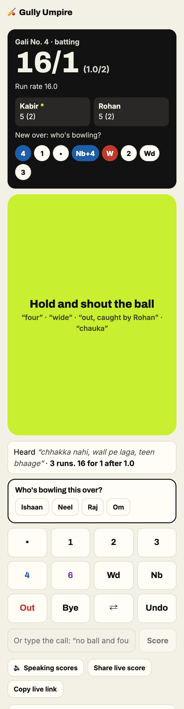
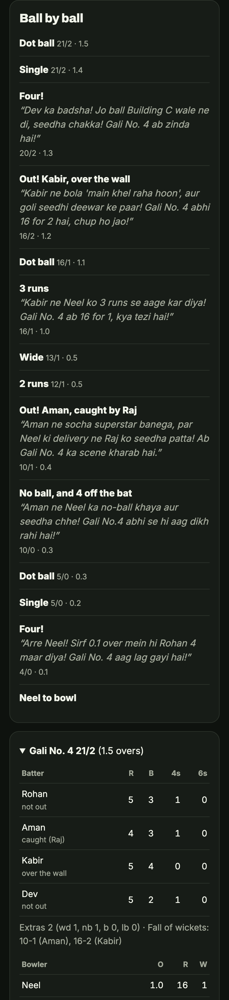
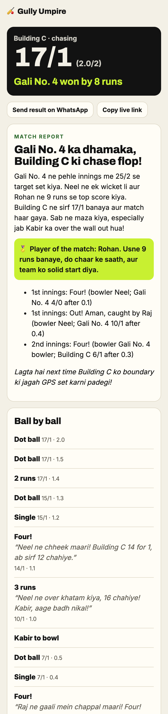

# Gully Umpire

[](https://github.com/abjt01/gully-umpire/actions/workflows/ci.yml)
[](https://render.com/deploy?repo=https://github.com/abjt01/gully-umpire)

Shout the score, keep the phone in your pocket. Gully Umpire scores street cricket by voice: someone yells "four!", "wide!" or "out, caught by Rohan!", and it keeps the scorecard, says the score back out loud, and plays commentator after the big moments. It plays by your lane's rules too: over the wall is out, one tip one hand, last man stands.

**Try it:** [gully-umpire-fu6e.onrender.com](https://gully-umpire-fu6e.onrender.com). It's on a free plan, so the first load after a quiet spell takes about half a minute.

Built for the Hacktoberfest 2026 DEV challenge, week 1: *Touch Grass*.

<table>
  <tr>
    <td></td>
    <td></td>
    <td></td>
  </tr>
</table>

## How a match goes

1. **Set up in a minute.** Team names, overs, and your lane's rules in plain words ("wall ke upar gaya toh out"). The umpire reads them back as switches you can check. Player names are optional.
2. **Put the phone down.** Whoever's scoring holds the big button and shouts the ball. The screen stays on by itself.
3. **Listen, don't look.** After every ball it says the score back. After wickets, boundaries and overs, the commentator chimes in.
4. **Friends follow along** on a live link, and at the end there's a match report for the group chat.

If it's too loud to talk there's a button pad, and you can type a call too. Every call is spoken back, so a wrong one is one "undo" away.

## The umpire listens, code keeps score

The models never touch the score directly.

- **The scorecard is replayed from a list of ball events.** Runs, strike rotation, overs, extras, wickets, all out, targets and results are plain code with unit tests. Undo just drops the last event.
- **Lane rules are enforced by the engine**, not the model. If your lane says over the wall is out, a "six" becomes a wicket however it was called, and "no LBW" means an LBW call is ignored.
- **The model only turns words into events.** Simple calls ("four", "chauka", "wide", "do run", "bowled") are matched instantly in code. Messy ones ("wide hai aur do run bhaag liye", "Raj ne lapka") go to an open model, and its answer is checked before the engine sees it.

## Hinglish, shouted, in the street

Speech-to-text on street cricket breaks in specific ways. These are the ones that came up while building it, and what the app does about each:

| What happened | What it does now |
|---|---|
| Whisper hears silence and returns "Thank you." | Known silence phrases count as nothing heard, and presses under half a second are ignored |
| "chauka" comes back in Cyrillic: "чauka" | Cyrillic letters are read as Latin before parsing |
| "no ball pe chauka" comes back as "No ball, pichauka" | A no ball with a number word anywhere in the call is enough |
| "caught by Neel" comes back as "neel" | Names are matched back to how they were typed at setup |
| "wall pe laga, do run" (hit the wall) scored as over the wall | The umpire knows hitting the wall is runs and going over it is out |
| A four described as "chakka" by the commentator | The commentator gets the exact event, not just the text |

Whisper also gets a vocabulary hint (chauka, chhakka, clean bowled, one tip one hand) and the player names, which is the difference between "chauka" and "Пока".

## Why open models

- **Swap any piece.** Ears, umpire, commentator and writer are separate open-weight models: Whisper large v3 turbo, GPT-OSS 20B, Qwen 3.8 27B and GPT-OSS 120B. Each one is a single setting. The commentator is Qwen because it wrote the most natural Hinglish when I ran all three on the same moments, and it was the fastest.
- **Free to run.** Groq serves all of them on its free tier, fast enough that a call is scored in under two seconds.
- **No lock-in.** The app talks to any OpenAI-compatible server, so it can move to self-hosted models without a rewrite.

## Run it locally

```bash
npm install
cp .env.example .env   # add a free key from https://console.groq.com/keys
npm run dev            # http://localhost:4100
```

Without a key the buttons and simple typed calls still work. Voice, commentary and match reports need one.

Microphones only work on `localhost` or HTTPS, so to try it on your phone, use the deployed version or a tunnel.

## Configuration

| Variable | Default | What it does |
|---|---|---|
| `GROQ_API_KEY` | none | Groq key |
| `WHISPER_MODEL` | `whisper-large-v3-turbo` | Speech to text |
| `PARSE_MODEL` | `openai/gpt-oss-20b` | Turns messy calls into ball events |
| `COMMENTARY_MODEL` | `qwen/qwen3.8-27b` | One line after big moments (falls back to `COMMENTARY_BACKUP_MODEL`) |
| `REPORT_MODEL` | `openai/gpt-oss-120b` | The match report |
| `LLM_BASE_URL` | Groq | Any OpenAI-compatible server |
| `MONGODB_URI` | none | Keep matches in MongoDB instead of a JSON file |
| `DATA_DIR` | `./data` | Where the JSON file lives |

## Tests

```bash
npm run lint
npm test            # unit: the scoring engine, lane rules, quick calls, speech-to-text quirks
npm run build
npm run test:api    # the API against the built app
npm run test:e2e    # real Chrome: every screen at 320–1280px in light and dark, then the flows
```

API and browser tests run the built app without an AI key, on a spare port with a throwaway data folder. The browser tests load every screen with the longest data the app accepts (20-letter names, Devanagari, emoji, a busy over full of extras) and fail on anything that overflows. Then they set up a match, score with the pad, open the out and no-ball sheets, undo, type calls, follow along as a friend, finish the match and write the report.

## CI and deploys

GitHub Actions runs lint and unit tests in one job, and the build plus API and browser tests in another. Render deploys from `render.yaml` only after CI passes, and Dependabot keeps dependencies current.

## Deploy your own (free)

Click **Deploy to Render** above and add your `GROQ_API_KEY`. Render's free tier sleeps when idle and wipes its disk, so add a free MongoDB Atlas cluster as `MONGODB_URI` if you want old matches to stick around.

## Layout

```
app/                  pages and API routes (Next.js App Router)
components/           MatchRoom, Recorder (hold to talk), Pad, Scoreboard, Scorecard
lib/
  engine.js           the scorer: replays ball events, enforces lane rules
  calls.js            instant calls, Hinglish and Devanagari, event checks
  umpire.js           the model parts: hearing, calls, rules, commentary, report
  matches.js          match lifecycle, scorer-only actions, per-match locking
  llm.js, store.js    OpenAI-compatible client with Whisper; JSON file or MongoDB
test/                 unit, API and browser tests
```

## Limitations

- Voice needs signal. If it drops, the button pad still scores.
- Wind and crowd noise will beat Whisper sometimes. That's why every call is read back and undo is one word.
- The scorer's link is the only access control, so don't share it, share the live link.
- Without `MONGODB_URI`, matches live on one server's disk, so run a single instance.

## License

[MIT](LICENSE)
